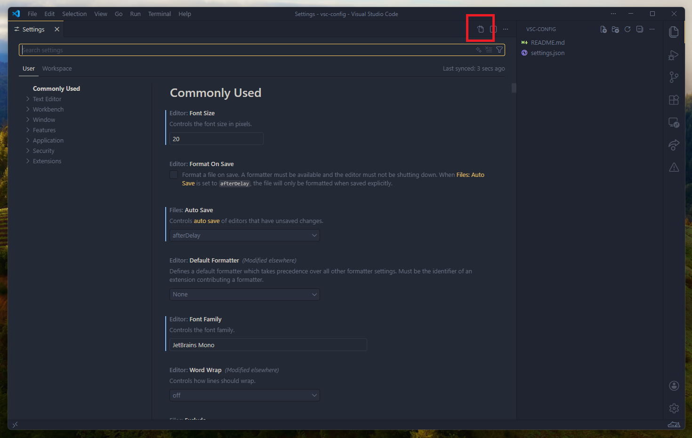

# VSCode configuration

Here I store my current and up-to-date configuration file for my [Visual Studio Code](https://code.visualstudio.com/) installation. Copy it, do anything you want with it ;)

## Install it on your instance

1. Open `settings.json` file in this repository.
2. Open up [Visual Studio Code](https://code.visualstudio.com/).
3. Press <kbd>CTRL</kbd> + <kbd>,</kbd> to open the settings.
4. Click on the button on the upper right corner to open JSON text mode. (as of attached image)

5. Press <kbd>CTRL</kbd> + <kbd>A</kbd> to select everything and hit <kbd>DEL</kbd>.
6. Paste what you copied in the `settings.json` file earlier.
7. Press <kbd>CTRL</kbd> + <kbd>S</kbd> to save and it should automatically update your configuration.